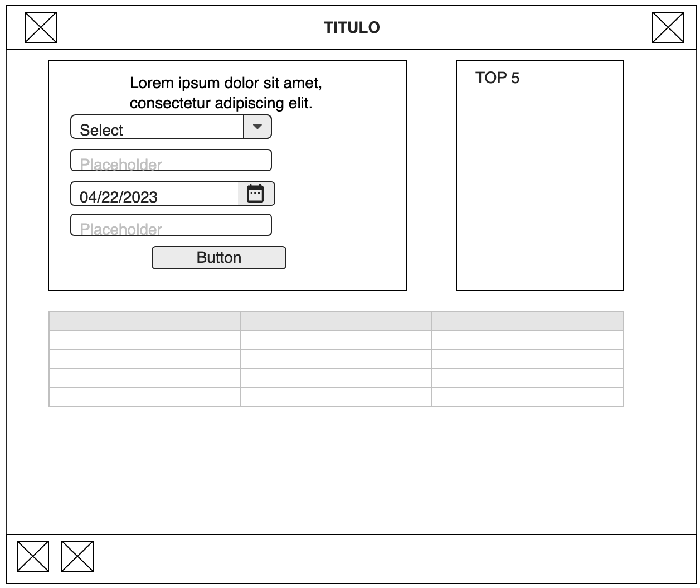

# Proyecto 2 aplicación CRUD
Para este proyecto creamos una aplicación CRUD (create,read,update,delete) una aplicación capaz de crear, leer, actualizar y elimnar informacion.

## Descripcion basica
En este proyecto decidi crear una aplicacion donde se pudieran colocar la peliculas,series o libros que se hayan visto para luego puntuarlos y crear una lista de recomendaciones.

## Tecnologias utilizadas
para relizar esta pagina se uso html,css,css flex y javascript

## Prototipado Simple

[link](patriciof02.github.io/Proyecto2AplicacionCrud/)
